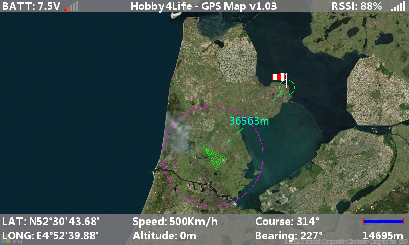

# H4LGPSMAP
 Hobby4life ETHOS GPS Map Widget

------

Hobby4life has created it's own version of a ETHOS GPS Map widget, with some extra features.

This widget can be used with ETHOS v1.1.0 and higher, and is compatible with Horus X10/X12 and Tandem X20

------

Download: https://github.com/Hobby4life/H4LGPSMAP/releases/download/v1.0.6/h4lgpsmap.zip

#### Changes:

###### v1.06

- minor fix Coordinate readout
- Multiple H4LGPSMAP widgets loaded caused interaction, fixed
- Big cleanup of script, lot of commenting done to understand the script.

###### v1.05

- Map measurement indicator moved
- LOS (Line of Sight) readout added in bottom box
- Ground Distance readout added in bottom box
- Measurement readout improved.. now switches from m to km, and foot to miles. for Altitude and Distance readouts.
- Overal readout display positions changed
- Stick GPS Simulation added
  - This will enable GPS simulator, 2 sticks are needed to simulate Latitude & Longitude, midstick is center of map.

- Default maps are changed, Amsterdam map as default map1.lua

###### v1.04

- No GPS selected detection fixed

###### v1.03

- First release

------

## Installation:

Copy the **h4lgpsmap** folder with all its content to the folder **/scripts** on your **SD card**.

The only files that have to be edited by user are:

**/scripts/h4lgpsmap/maps/mapnames.lua**

And

**/scripts/h4lgpsmap/maps/map1.lua**

through

**/scripts/h4lgpsmap/maps/map8.lua**

## Configuration:

For using this widget

1. Select a fullscreen widget
2. Turn off the Title of the widget.

### Select Map:

Here you can select 1 of the 8 maps, the names here are located in **/scripts/h4lgpsmap/maps/mapnames.lua**

The name locations inside **mapnames.lua** correspond to **map1.lua** trough **map8.lua**

Maps can be generated online at https://ethosmap.hobby4life.nl

In the generated zip file there is a **map.lua** file.

This file should eventually be renamed to **map1, map2, map3** etc. whatever you need.

### Units:

Here you can set the units to **Metric (m/kmh)** or **Imperial (ft/mph)**

### GPS Source:

Select your GPS sensor here

### Speed Source:

Select your Speed sensor here, this can be the GPS speed sensor, or any other sensor that indicates speed.

### Altitude Source:

Select your Altitude sensor here, this can be the GPS Altitude sensor, or any other sensor that indicates altitude.

### RSSI Source:

Select any sensor that indicates RSSI

### Reset Source:

This source will set/reset the Home position.
Select an input, This source triggers at any value of +100 / +1024

### Course Source:

Select your Course/Bearing/Heading sensor here, this can be the GPS Course sensor, or any other sensor that indicates course/bearing or heading. 0-360.
This input is used to set the angle of the arrow.

### Calculate Course:

If selected this will override/disable the Course Source input and calculates the course depending on the movement.
This can be usefull if your GPS has no course/heading output.

Accuracy of this calculation can be set in the next configuration option: **Update distance, m/ft**

### Update Distance, m/ft

Here you can configure when to update the course calculation every X meters or feet.
The greater the distance the greater the accuracy. low values will cause jitter.
Also this depends on the size of the map used.

### GPS Coordinates:

Here you can select if you want to have a Decimal or DMS (Degree/Minuts/Seconds) readout.

### Arrow Color:

Select the color of the arrow

### HUD Text Color:

Select the color of all text of the widget. Top and Bottom bar.

### Distance Text Color:

Select the color of the text that is used to show the distance between plane and home.

### Line Color:

Select the color of the line that is used to show the bearing of the plane from home.

### Stick GPS Simulator:

Enables a GPS simulation controlled by Stick or any other source input.

### Latitude Source Stick:

Select Latitude control input for Stick GPS Simulation.

### Longitude Source Stick:

Select Longitude control input for Stick GPS Simulation.
